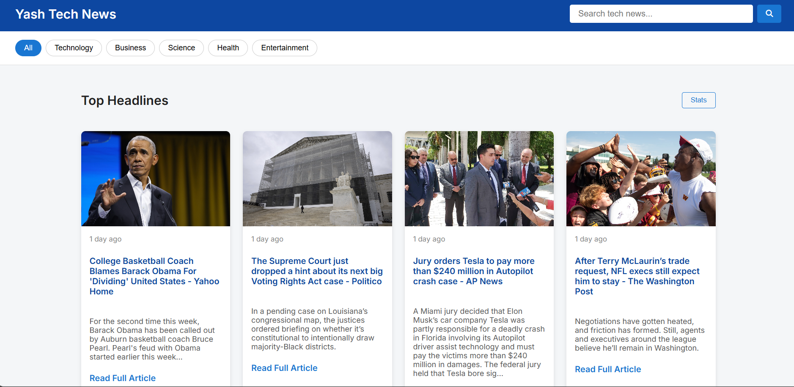

# 📰 Yash Tech News

A modern, responsive web application that delivers **real-time tech news updates** using the [NewsAPI](https://newsapi.org/). Designed with a clean, human-friendly UI and category-wise filtering for a smooth news-reading experience.



---

## 🚀 Features

- 🔍 **Live News Fetching** via NewsAPI (free tier)
- 🎨 **Responsive Design** with modern UI aesthetics
- 🌙 **Theme Switcher** (Light/Dark Mode)
- 📚 Category Filters – Technology, Business, Science, Health, Entertainment
- ⌛ Real-time timestamp formatting (relative and absolute)
- 📊 Stats Panel showing live article count and update time
- ⚠️ Developer Account Limit Error Handling
- 🧠 Built with Vanilla JS, HTML5, CSS3

---

## 🔧 Setup Instructions

> **Note:** You’ll need a free API key from [newsapi.org](https://newsapi.org/).

### 1. Clone the repository
```bash
git clone https://github.com/yaswanth-koppanathi-ai/yash-tech-news.git
cd yash-tech-news
```

### 2. Add your NewsAPI Key
Open the `app.js` file and replace the placeholder:

```js
const API_KEY = 'YOUR_API_KEY_HERE';
```

### 3. Launch Locally
You can open `index.html` directly in your browser or run with a live server:
```bash
npx live-server
```

---

## 📁 Project Structure

```
├── index.html        # Main page
├── landing.html      # Intro landing screen
├── app.js            # API logic + DOM handling
├── style.css         # Main styling
├── README.md         # Project info
```

---

## 🙋‍♂️ Developer

**Yaswanth Koppanathi**  
🔗 [LinkedIn](https://www.linkedin.com/in/yaswanth-koppanathi-ai/)  
💻 [GitHub](https://github.com/yaswanth-koppanathi-ai)  
📧 yaswanthkoppanathi24@gmail.com

---

## 📝 License

This project is licensed under the MIT License – feel free to fork, improve and share!